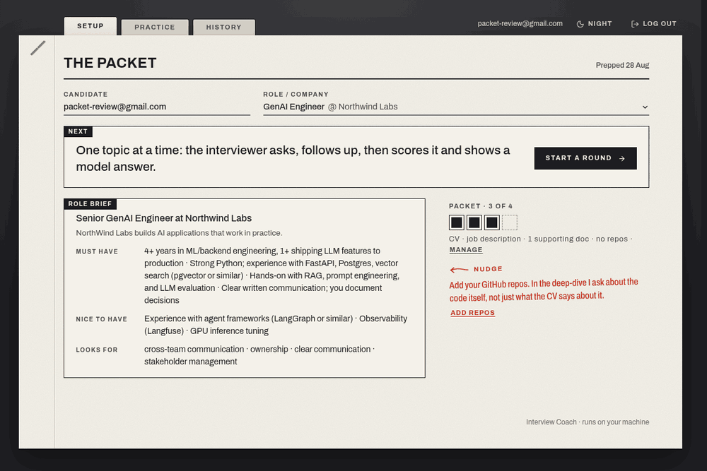
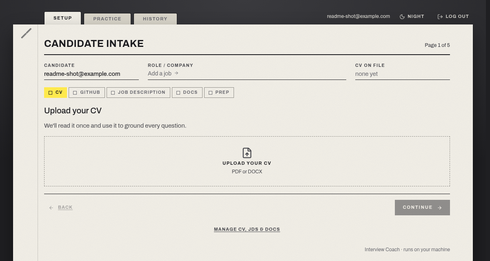
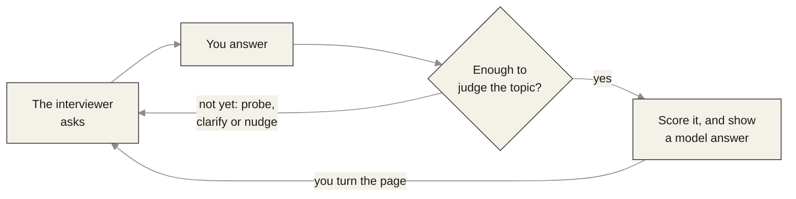
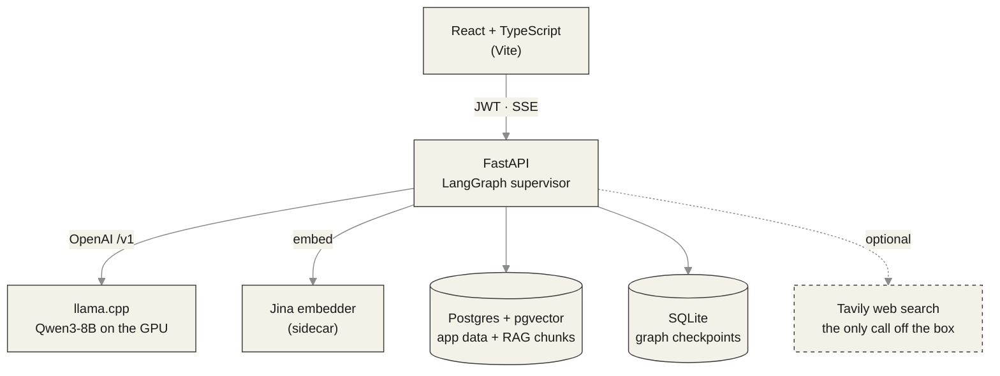

# Interview Coach

**Personalized interview practice that runs on your own machine.** Give it your
CV, the job description and whatever else you would bring to the interview. It
runs a real back-and-forth interview against a local LLM: it asks, it follows up
on what you actually said, then scores each topic and shows you a model answer.

Nothing leaves the box. FastAPI + React, Postgres, and Qwen3-8B on your own GPU.
Web search is optional and is the only thing that ever reaches out.

## Demo



One real round, recorded end to end. The model's thinking time between turns is
cut and the longer scenes are tightened, but every frame is the app's own.
[How it was recorded](scripts/demo/README.md).

## How it works

Two phases. You prep a **packet** once per role, then run as many rounds against
it as you like.

### 1. Prep the packet



Five pages of intake, then one pass that reads everything:

| Page | What you give it | Why |
| --- | --- | --- |
| **CV** | A PDF or DOCX | Read once, then used to ground every question |
| **GitHub** | Your handle, then pick public repos | Lets the deep-dive ask about the code, not just the CV |
| **Job description** | Pasted text, or a URL to fetch | Role, company and must-haves are extracted automatically |
| **Docs** | Architecture notes, take-homes, write-ups | Optional, but this is what makes questions specific |
| **Prep** | Nothing - it runs | Builds your profile, embeds the docs, researches the company |

What comes out is the packet: a role brief, everything on file, and the gaps
worth filling before you practice.

### 2. Run a round

The interviewer works one **topic** at a time. Rather than firing off
disconnected questions, it stays on a thread until it has enough to judge, then
grades the whole exchange at once and moves on.



You turn the page yourself: a scored topic stays on the sheet, with its
assessment and model answer, until you ask for the next one.

### Round types

| Round | What it tests | Grounding |
| --- | --- | --- |
| **Experience deep-dive** | Your real projects and CV | Retrieves from your docs and linked GitHub repos |
| **Technical challenge** | Forward-looking domain problems | None - it tests reasoning, not recall |
| **Behavioral / STAR** | Situation, Task, Action, Result stories | None |

## Architecture



| Piece | Role |
| --- | --- |
| **React + TypeScript** | The UI; a typed client streams questions and feedback over SSE |
| **FastAPI + LangGraph** | Auth, sessions, and the multi-agent interview loop |
| **llama.cpp** (`llama`) | Serves Qwen3-8B on the GPU over an OpenAI-compatible `/v1` |
| **Jina embedder** | Sidecar that embeds your documents for retrieval |
| **Postgres + pgvector** | App data plus the grounding vectors |
| **Tavily** | Optional web search: fetch a JD from a URL, research a company |

## Quick start

You need **Docker** with the **NVIDIA Container Toolkit** for GPU passthrough,
and the model file (below).

```sh
cp .env.example .env                  # add TAVILY_API_KEY to fetch JDs from URLs
make up                               # db, llama, embedder, api, ui
curl http://localhost:8000/healthz    # -> {"status":"ok",...}
open http://localhost:8501            # the app
```

Register an account, and you land on the intake above.

Cold start takes 30 to 60 seconds while `llama-server` loads the model onto the
GPU. The first agent call may be slow, then it is fast.

<details>
<summary><b>One-time: download the model (GGUF)</b></summary>

```sh
mkdir -p ~/models
huggingface-cli download unsloth/Qwen3-8B-GGUF Qwen3-8B-IQ4_XS.gguf \
  --local-dir ~/models
# no huggingface-cli? pipx install -U "huggingface_hub[cli]"
```

Compose bind-mounts `~/models` read-only at `/models` and looks for
`Qwen3-8B-IQ4_XS.gguf` by default. Point it elsewhere with `MODELS_DIR` and
`MODEL_FILE` in `.env`.

On Arch / CachyOS, set up the toolkit with:

```sh
pacman -S nvidia-container-toolkit
sudo nvidia-ctk runtime configure --runtime=docker && sudo systemctl restart docker
```

</details>

### Where things listen

| Service | URL |
| --- | --- |
| App (React UI) | http://localhost:8501 |
| API docs | http://localhost:8000/docs |
| llama.cpp server | http://localhost:8080 |
| Adminer (DB UI) | http://localhost:8090 |

## Common commands

```sh
make up      # build and start everything
make down    # tear down
make test    # the test suite (host, in-memory SQLite - no containers needed)
make lint    # ruff check
make fmt     # ruff format
make logs    # tail logs
make ps      # service status
make db-ui   # print the Adminer login for the local DB
```

## Docs

- [`plan/master.md`](plan/master.md) - the full phased build plan and current architecture
- [`CONTEXT.md`](CONTEXT.md) - domain glossary and vocabulary
- [`docs/adr/`](docs/adr/) - architecture decision records
- [`scripts/demo/`](scripts/demo/README.md) - how the demo GIF is recorded

<details>
<summary><b>Advanced: eval harness and observability</b></summary>

**Question-quality eval harness** (`tests/integration/eval/`) drives the real
`stream_question` against the local LLM and scores distinctness, profile
groundedness and JD relevance:

```sh
INTEGRATION=1 uv run pytest tests/integration/eval -k quality -v
uv run python -m tests.integration.eval.report   # comparison table
```

`make test` skips this - it never touches the LLM.

**Langfuse tracing**: set `LANGFUSE_PUBLIC_KEY` and `LANGFUSE_SECRET_KEY` (and
optionally `LANGFUSE_HOST`) in `.env` to send per-request LangGraph traces.
Unset, the app behaves identically: no SDK init, no network calls.

</details>

## Layout

```
src/interview_coach/   # FastAPI app + LangGraph agents, db, llm, providers
frontend/              # React + TypeScript app (served by the ui container)
alembic/               # database migrations
scripts/demo/          # the demo recorder
tests/                 # pytest
plan/ · docs/          # build plan, ADRs, domain context
```
